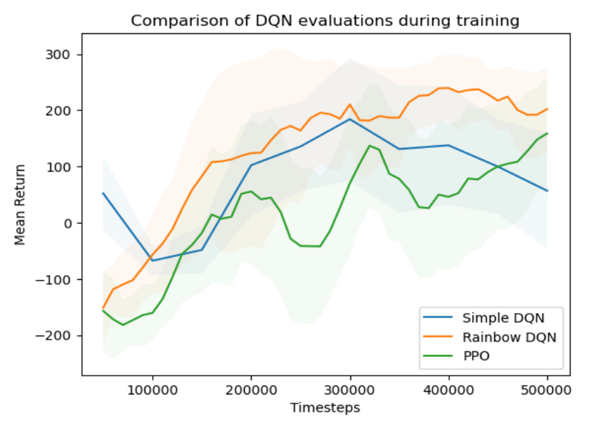
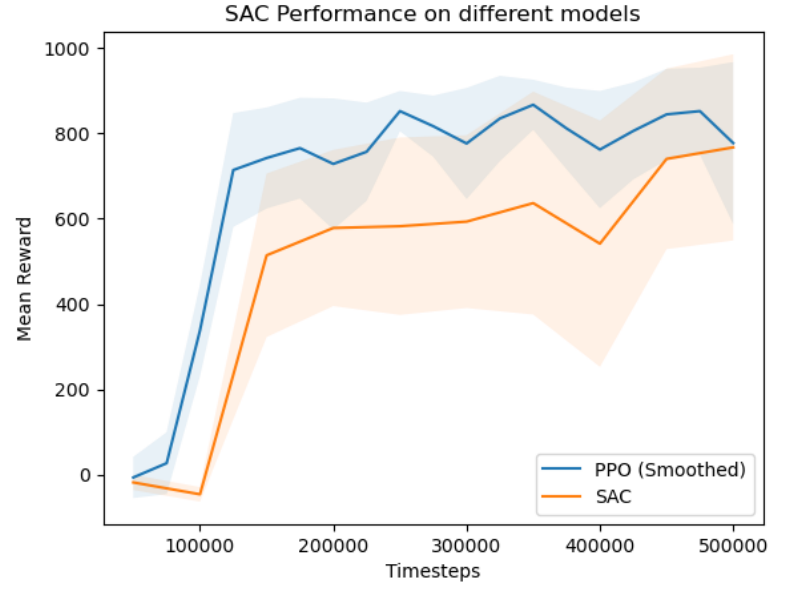

# LunarLander and CarRacing RL Agents

This project compares reinforcement learning agents on two Gymnasium control tasks: `LunarLander-v3` and `CarRacing-v3`. It evaluates tabular methods, value-based deep RL, and policy-gradient / actor-critic methods using saved training logs, evaluation metrics, and demonstration videos.

Authors: Alexandre Goncalves, Gaspar Pereira, Joao Henriques, Rita Wang, Victoria Goon

## Technical Stack

| Area | Tools and skills used |
| --- | --- |
| Programming environment | Python, Jupyter |
| Reinforcement learning | Q-learning, SARSA, DQN, Rainbow-DQN, PPO, SAC |
| RL tooling | Gymnasium, Stable-Baselines3 |
| Deep learning | PyTorch |
| Data processing and evaluation | NumPy, pandas, evaluation callbacks, episodic return analysis |
| Visualization | Matplotlib, Seaborn, recorded policy videos |
| Version control | Git, GitHub, organized notebooks and saved artifacts |

## Key Outcomes

- Compared reinforcement learning algorithms across discrete-control and continuous-control environments.
- Evaluated each trained agent over 30 episodes after 500,000 training timesteps.
- Achieved the best LunarLander result with Rainbow-DQN: average return `262.36` and `93%` success rate.
- Achieved the best CarRacing result with PPO: average return `874.59` and `40%` success rate under the project success threshold.
- Preserved saved models, evaluation logs, and policy videos while stripping notebook outputs to avoid duplicated embedded data.

## Challenges and Design Choices

| Challenge | Design choice |
| --- | --- |
| Comparing different RL problem types | Used two environments with different state and action spaces: LunarLander uses low-dimensional vector observations and discrete actions, while CarRacing uses image observations and continuous steering/throttle/brake actions. |
| Tabular methods on continuous LunarLander states | Discretized the LunarLander state space to test Q-learning and SARSA as baselines, then compared them with neural-network-based methods when uniform binning failed to capture enough state dynamics. |
| Stabilizing value-based deep RL | Compared DQN with Rainbow-DQN, which combines prioritized replay, multi-step learning, double Q-learning, dueling architecture, distributional Q-learning, and noisy networks for better exploration and stability. |
| Handling high-dimensional CarRacing observations | Preprocessed image observations by converting frames to grayscale, resizing to `84x84`, and stacking four frames to give the agent temporal context. |
| Exploration versus stable driving in continuous control | Tuned entropy-related parameters for PPO and SAC because insufficient entropy reduced robustness, while excessive policy stochasticity could slow convergence or produce jittery driving behavior. |

## Results

| Environment | Algorithm | Average return | Std. dev. | Success rate |
| --- | --- | ---: | ---: | ---: |
| LunarLander-v3 | DQN | 195.57 | 71.07 | 67% |
|  | Rainbow-DQN | **262.36** | 49.81 | **93%** |
|  | PPO | 172.96 | 102.27 | 66.7% |
| CarRacing-v3 | PPO | **874.59** | 167.95 | **40%** |
|  | SAC (stochastic policy) | 848.38 | 145.29 | 30% |

Success rate threshold:

- LunarLander-v3: reward greater than `200`
- CarRacing-v3: reward greater than `900`

## Evaluation Plots

The LunarLander comparison shows why Rainbow-DQN was selected as the strongest discrete-control agent: it reached higher returns than Simple DQN and PPO during training and remained more stable near the end of the run.

<p align="center">
  
</p>

The CarRacing comparison summarizes the final continuous-control comparison between PPO and SAC. PPO converged faster, while SAC remained competitive but more sensitive to entropy-driven stochastic behavior.

<p align="center">
  
</p>

## Demonstrations

Only selected policy videos are shown: the best LunarLander agent and the two CarRacing methods compared in the final discussion.

### LunarLander-v3 - Rainbow-DQN

https://github.com/user-attachments/assets/2ee71215-b8a5-434f-863c-0aa7584517cb

### CarRacing-v3 - SAC

Evaluated with a stochastic policy.

https://github.com/user-attachments/assets/b09baaa2-e97f-419b-b060-9d86c31fa2dc

### CarRacing-v3 - PPO

Evaluated with a deterministic policy.

https://github.com/user-attachments/assets/2bde3989-2aa6-4c98-ac3a-646e8294e8be

## Repository Structure

```text
.
├── notebooks/             # Clean notebooks with outputs stripped
├── utils/                 # Shared RL utilities and segment tree implementation
├── logs/                  # Saved models, evaluation CSVs, and NPZ logs
├── videos/                # Local policy rollout videos
├── report/                # Final project report
├── docs/assets/           # README figures extracted from the report appendix
├── requirements.txt       # Python dependencies
└── README.md
```

## Notebooks

- `notebooks/0_lunar_landing_ql_ppo.ipynb`: LunarLander tabular Q-learning, SARSA, and PPO workflow.
- `notebooks/1_lunar_landing_dqn_comparison.ipynb`: LunarLander DQN and Rainbow-DQN comparison.
- `notebooks/3_car_racing_ppo.ipynb`: CarRacing PPO training and evaluation.
- `notebooks/4_car_racing_sac_comparison.ipynb`: CarRacing SAC evaluation and comparison with PPO.

The notebooks include a small path setup cell so they can import the shared `utils` package after being moved into the `notebooks/` folder.

## Setup

Create and activate a virtual environment:

```bash
python -m venv .venv
source .venv/bin/activate
```

Install dependencies:

```bash
pip install -r requirements.txt
```

The saved artifacts in `logs/` and `videos/` allow results to be inspected without retraining every agent.
